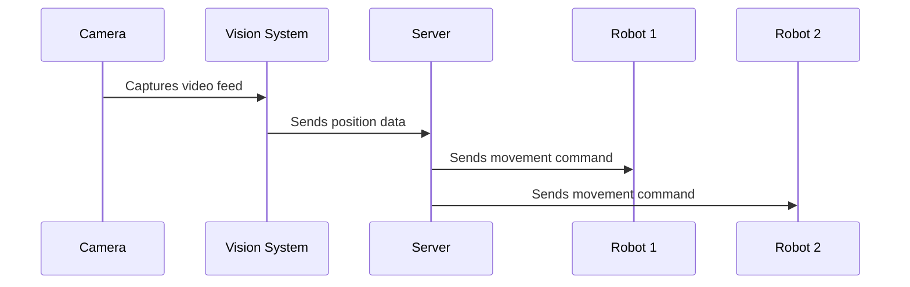

# Robot Coordination System: A Practical Guide

## Quick Reference Tables

### Color Detection Parameters

| Color  | Purpose | HSV Lower Bound | HSV Upper Bound | Min Area |
|--------|---------|----------------|-----------------|----------|
| Green  | Robot 1 | [56, 179, 47]  | [162, 255, 255] | 1000px²  |
| Pink   | Reference| [165, 101, 75] | [179, 255, 255] | 2000px²  |
| Blue   | Robot 2 | [110, 71, 0]   | [160, 255, 255] | 2000px²  |

### Hardware Specifications

| Component | Model/Type | Pin Configuration | Purpose |
|-----------|------------|------------------|----------|
| Microcontroller | ESP8266 | - | WiFi-enabled control |
| Motor Driver | L298N | ENA: D5<br>ENB: D6<br>IN1: D8<br>IN2: D7<br>IN3: D4<br>IN4: D3 | Motor control |
| Camera | USB Webcam | USB Port | Vision input |
| Motors | DC Motors | Connected to L298N | Robot movement |

### Communication Parameters

| Parameter | Value | Description |
|-----------|-------|-------------|
| MQTT Broker IP | 36.255.69.54 | Central server address |
| MQTT Port | 1883 | Communication port |
| Topics | iort<br>bot1<br>bot2 | Data & control channels |
| Update Rate | 2 seconds | Command frequency |

### System Performance Metrics

| Metric | Typical Value | Acceptable Range |
|--------|--------------|------------------|
| Vision Processing | 30 FPS | 25-60 FPS |
| Communication Latency | 100-200ms | <500ms |
| Robot Response Time | <1 second | <2 seconds |
| Color Detection Accuracy | 95% | >90% |
| Movement Precision | ±5cm | ±10cm |

## What Does This System Do?

This is a smart robot coordination system that uses a camera to track robots and assign them tasks based on their positions. Think of it as a traffic controller for robots that:

1. Watches the robots using a camera
2. Measures distances between them
3. Decides which robot should handle a task
4. Sends commands to the chosen robot

## Core Components

### 1. Eyes of the System (Vision Component)
- Uses a webcam to watch the workspace
- Looks for three specific colors:
  * Green marker
  * Pink marker (reference point)
  * Blue marker
- Constantly measures distances between these markers

### 2. Brain of the System (Server Component)
- Receives position information
- Makes decisions about which robot should move
- Sends commands to robots
- Monitors how well the system is performing

### 3. The Robots
- Two ESP8266-based robots
- Each robot can move forward and stop
- They listen for commands over WiFi
- Use standard DC motors for movement

## How It All Works Together

1. **Starting Up**


2. **Task Assignment Process**
- Camera spots the colored markers
- System calculates distances between markers
- Server picks the closest robot
- Chosen robot receives a movement command

3. **Robot Response**
- Robot receives command
- Moves forward for 2 seconds
- Automatically stops
- Ready for next command

## Technical Details Made Simple

### Vision System
```python
Key Functions:
- find_color1() → finds green marker
- find_color2() → finds pink marker
- find_color3() → finds blue marker
- distance() → calculates distance between markers
```

### Communication
- Uses MQTT (like a postal service for robots)
- Server address: 36.255.69.54
- Port: 1883
- Messages contain:
  * Current time
  * Distance to Robot 1
  * Distance to Robot 2

### Robot Hardware Setup
```
Motors:
- Right Motors → D5, D8, D7
- Left Motors → D6, D4, D3
Speed: Set to 100 (medium speed)
```

## Common Operations

### 1. System Startup
1. Power on the robots
2. Start the server (server.py)
3. Launch the vision system (main.py)
4. Place robots in the camera's view

### 2. Color Calibration
- Use trackbar.py to adjust color detection
- Slide bars until colors are clearly visible
- Save the HSV values

### 3. Testing
- Use webcam.py to check camera
- Use pub.py to test communication

## Troubleshooting Guide

### Common Issues and Solutions

| Issue | Symptoms | Possible Causes | Solutions |
|-------|----------|----------------|-----------|
| Robot Unresponsive | No movement after command | - Low battery<br>- Lost WiFi<br>- MQTT disconnection | 1. Check battery voltage<br>2. Verify WiFi connection<br>3. Restart MQTT client |
| Poor Color Detection | Inconsistent tracking | - Bad lighting<br>- Wrong HSV values<br>- Dirty lens | 1. Adjust ambient lighting<br>2. Run trackbar.py calibration<br>3. Clean camera lens |
| High Latency | Delayed responses | - Network congestion<br>- Processing overload<br>- Multiple clients | 1. Check network traffic<br>2. Reduce video resolution<br>3. Limit connected clients |
| Erratic Movement | Unpredictable robot behavior | - Motor issues<br>- Interference<br>- Code timing | 1. Check motor connections<br>2. Verify power supply<br>3. Debug timing loops |
| System Crash | Complete system freeze | - Memory overflow<br>- Exception errors<br>- Hardware failure | 1. Check system logs<br>2. Verify error handling<br>3. Test hardware components |

### Quick Diagnostic Checklist

| Component | Check Points | Expected Status |
|-----------|-------------|-----------------|
| Camera | - USB connection<br>- Driver status<br>- Frame rate | - Solid connection<br>- Driver active<br>- >25 FPS |
| Network | - WiFi signal<br>- MQTT connection<br>- Latency | - >70% strength<br>- Connected<br>- <500ms |
| Robots | - Battery voltage<br>- Motor response<br>- LED indicators | - >7V<br>- Smooth movement<br>- Normal pattern |

## Performance Monitoring

The system tracks:
- Time between command and execution
- Accuracy of color detection
- Robot response time
- Network communication speed

## Safety Features

1. Automatic stop after movement
2. Minimum distance checks
3. Motor speed limits
4. Error reporting
